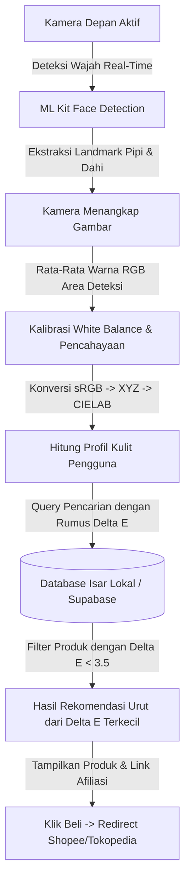

# GlowMatch Mobile Application
## TECHNICAL & FUNCTIONAL BLUEPRINT (FLUTTER ARCHITECTURE - V2.2)

---

## 1. Executive Summary & Product Vision

**GlowMatch** adalah aplikasi mobile berbasis Flutter yang dirancang untuk mendigitalisasi konsep *Color Theory* (Teori Warna) ke dalam industri kecantikan dan kosmetik wanita. 

Masalah utama yang diselesaikan adalah tingginya angka kesalahan pemilihan warna produk kosmetik (seperti *foundation*, *concealer*, dan *lipstik*) akibat ketidakpahaman konsumen terhadap *skin tone* dan *undertone* mereka secara objektif, serta pengaruh pencahayaan lingkungan yang menipu mata telanjang.

Dengan memanfaatkan pemrosesan citra digital (*image processing*) melalui kamera smartphone, integrasi deteksi wajah cerdas, serta perhitungan matematis jarak warna di ruang warna **CIELAB**, GlowMatch mampu mendeteksi kecocokan warna secara ilmiah, presisi, dan memberikan rekomendasi produk komersial yang dapat langsung dibeli konsumen melalui tautan afiliasi (*affiliate links*).

---

## 2. Freemium Monetization Matrix & Revenue Model

GlowMatch menerapkan model bisnis Freemium yang diintegrasikan dengan sistem afiliasi e-commerce lokal (Shopee/Tokopedia).

| Feature Module | Access Tier | Functional Description & Technical Requirement |
| :--- | :--- | :--- |
| **Basic Undertone Scanner** | **FREE** | Pengguna memindai wajah dengan kamera depan untuk mendeteksi tingkat kecerahan kulit dasar (*Fair, Light, Medium, Tan, Deep*) dan *undertone* (*Warm, Cool, Neutral*). Menggunakan deteksi landmark wajah **Google ML Kit** untuk mengambil sampel piksel di pipi dan dahi, serta dikalibrasi terhadap *White Balance*. |
| **Color Wheel Reference** | **FREE** | Panduan Roda Warna interaktif untuk teknik *color correcting* (misal: warna hijau menetralkan kemerahan jerawat). Fitur ini murni edukatif, dinamis, dan statis secara data lokal. |
| **Standard Shade Catalog** | **FREE** | Akses melihat katalog warna kosmetik standar global secara teoretis tanpa merujuk pada merk komersial tertentu. |
| **Cross-Brand Shade Converter** | **FREE** | Fitur pencarian padanan warna kosmetik lintas merek komersial. Membandingkan kesamaan warna berdasarkan jarak warna **CIELAB Delta E** luring yang kontinu. |
| **Community Validation Loop** | **FREE** | Statistik kecocokan komunitas (*perfect, too dark, too light*) untuk mengkalibrasi rekomendasi warna secara dinamis tanpa merusak data master produk (*database poisoning prevention*). |
| **Virtual Makeup Pouch** | **FREE** | Pencatatan tanggal buka kosmetik luring, kalkulasi sisa usia kelayakan pakai (*PAO*), indikator visual bar progres gradien, dan penjadwalan notifikasi lokal otomatis. |
| **Advanced Color Mixing Calculator** | **PREMIUM** | Fitur simulator pencampuran 2 hingga 3 produk kosmetik dengan rasio tertentu (contoh: 60% Shade A + 40% Shade B). Sistem menghitung nilai akhir HEX Code secara real-time di ruang warna linear untuk menghindari distorsi kecerahan. |
| **Commercial Brand Matcher & Affiliate** | **PREMIUM** | Algoritma mencocokkan kode warna kulit hasil pemindaian langsung dengan database produk komersial nyata (lokal & global) menggunakan rumus **Delta E**. Terintegrasi dengan link affiliate Shopee/Tokopedia. |
| **Virtual Try-On (AR Overlay)** | **PREMIUM** | Simulasi langsung produk kosmetik (lipstik/blush-on) ke wajah pengguna menggunakan **Google ML Kit Face Mesh** 3D yang di-overlay dengan Flutter `CustomPainter`, efek *feathering* blur, dan opsi finishing (Matte/Glossy). |
| **Seasonal Color Palette & Hijab** | **PREMIUM** | Analisis dinamis 3-dimensi warna kulit (*Value, Chroma, Hue Angle*) untuk merekomendasikan palet 12 Musim Warna hijab dan kosmetik terbaik. |
| **Ad-Free & Unlimited Saves** | **PREMIUM** | Menghilangkan banner/interstitial iklan Google AdMob, serta memberikan kuota tak terbatas untuk menyimpan palet warna kustom hasil kreasi mandiri. |

---

## 3. Flutter Project Architecture & Directory Structure

Proyek dibangun di atas prinsip **Clean Architecture** yang dipadukan dengan **BLoC (Business Logic Component)** untuk menjamin pemisahan tanggung jawab (*separation of concerns*), performa UI yang mulus di 60-120 FPS, serta kemudahan dalam pengujian unit (*unit testing*).

### Core Tech Stack & Packages
*   **Camera & Landmark Detection:** `camera`, `google_mlkit_face_detection` (deteksi letak pipi/dahi), `google_mlkit_face_mesh_detection` (untuk overlay AR Try-On).
*   **Image Processing & Math:** `image` (Dart library), `vector_math` (kalkulasi matriks 3D).
*   **State Management:** `flutter_bloc` & `equatable`.
*   **Local Storage (Caching):** `isar` (Database lokal berkecepatan tinggi, tipe data relasional).
*   **Monetization & Ads:** `google_mobile_ads` & `purchases_flutter` (RevenueCat SDK).
*   **Remote Backend (Product Catalog):** `supabase_flutter` atau `firebase_core` (untuk sinkronisasi katalog produk komersial secara online).

### Directory Tree Structure
```
glowmatch/
├── android/
├── ios/
├── lib/
│   ├── core/
│   │   ├── errors/             # Penanganan eksepsi global
│   │   ├── network/            # Klien HTTP & Supabase wrapper
│   │   ├── theme/              # Desain sistem & skema warna premium
│   │   └── utils/
│   │       ├── color_calculator.dart  # Rumus matematika warna (sRGB, Linear, CIELAB, Delta E)
│   │       └── image_processor.dart   # Ekstraksi piksel berdasarkan landmark wajah
│   ├── features/
│   │   ├── scanner/            # Fitur Scan Wajah
│   │   │   ├── data/           # Repositori & sumber data (kamera & ML Kit)
│   │   │   ├── domain/         # Logika bisnis (Use Cases & Entitas Warna)
│   │   │   └── presentation/   # UI (BLoC, Widget Scanner, Preview Page)
│   │   │       ├── bloc/
│   │   │       └── pages/
│   │   ├── color_mixer/        # Fitur Pencampuran Kosmetik
│   │   │   ├── data/
│   │   │   ├── domain/
│   │   │   └── presentation/
│   │   ├── catalog/            # Fitur Pencocok Brand Komersial & Afiliasi
│   │   │   ├── data/
│   │   │   ├── domain/
│   │   │   └── presentation/
│   │   └── premium_subscription/# Fitur Langganan (RevenueCat)
│   │       ├── data/
│   │       ├── domain/
│   │       └── presentation/
│   └── main.dart
│   └── app_settings.dart       # Model Isar status premium luring
└── pubspec.yaml
```

---

## 4. Core Mathematical Logic for Color Matching & Blending

Seluruh logika matematika warna diisolasi di dalam `core/utils/color_calculator.dart` untuk menjamin performa tinggi dan kemudahan pengujian.

### A. Alur Pemrosesan Warna (Kamera ke CIELAB)
Untuk mendapatkan warna kulit asli tanpa distorsi cahaya, langkah berikut wajib dilakukan:
1.  **Deteksi Wajah:** Deteksi bounding box wajah menggunakan `google_mlkit_face_detection`.
2.  **Sampling Piksel:** Ekstrak koordinat pipi kiri, pipi kanan, dan dahi. Ambil rata-rata warna RGB di area tersebut.
3.  **Normalisasi & Kalibrasi:** Lakukan kalibrasi *White Balance* sederhana (mengarahkan pengguna untuk memegang kertas putih atau menggunakan auto-exposure adaptif).
4.  **Konversi RGB ke XYZ:**
    Konversikan sRGB non-linear ke sRGB linear, kemudian kalikan dengan matriks transformasi XYZ:
    $$\begin{bmatrix} X \\ Y \\ Z \end{bmatrix} = \begin{bmatrix} 0.4124 & 0.3576 & 0.1805 \\ 0.2126 & 0.7152 & 0.0722 \\ 0.0193 & 0.1192 & 0.9505 \end{bmatrix} \times \begin{bmatrix} R_{\text{linear}} \\ G_{\text{linear}} \\ B_{\text{linear}} \end{bmatrix}$$
5.  **Konversi XYZ ke CIELAB ($L^*a^*b^*$):**
    Menggunakan titik putih referensi D65 ($X_r, Y_r, Z_r$):
    $$L^* = 116 \cdot f(Y/Y_r) - 16$$
    $$a^* = 500 \cdot [f(X/X_r) - f(Y/Y_r)]$$
    $$b^* = 200 \cdot [f(Y/Y_r) - f(Z/Z_r)]$$
    Di mana $f(t) = t^{1/3}$ jika $t > 0.008856$, dan $f(t) = 7.787t + 16/116$ jika sebaliknya.

### B. Rumus Jarak Delta E ($\Delta E_{ab}^*$) untuk Shade Matching
Untuk mencari kemiripan antara kulit hasil scan ($T$) dan shade di database ($P$), hitung jarak Euclidean dalam ruang warna CIELAB:
$$\Delta E_{ab}^* = \sqrt{(L_T^* - L_P^*)^2 + (a_T^* - a_P^*)^2 + (b_T^* - b_P^*)^2}$$

*   **Interpretasi Jarak:**
    *   $\Delta E < 1.0$: Mata manusia tidak dapat membedakan beda warnanya (Kecocokan Sempurna).
    *   $1.0 \le \Delta E < 2.0$: Perbedaan sangat tipis, hanya terlihat oleh mata terlatih.
    *   $2.0 \le \Delta E < 3.5$: Perbedaan terlihat oleh mata biasa, namun masih dalam batas toleransi kosmetik yang baik.
    *   $\Delta E \ge 3.5$: Perbedaan warna terlihat jelas (Tidak cocok).
*   **Normalisasi Persentase Kecocokan:**
    $$\text{Match Percentage} = \max\left(0, \min\left(100, 100 - (\Delta E_{ab}^* \times 10)\right)\right)$$

### C. Persamaan Pencampuran Warna Dinamis (*Color Blending*)
Pencampuran kosmetik cair dihitung menggunakan rata-rata tertimbang dari komponen warna linear:
$$C_{\text{mixed\_linear}} = (W_1 \times C_{1\text{\_linear}}) + (W_2 \times C_{2\text{\_linear}}) + (W_3 \times C_{3\text{\_linear}})$$
Di mana $W$ adalah rasio pencampuran (misal: $W_1 = 0.6, W_2 = 0.4$, total $W = 1.0$). Setelah dicampur di ruang warna linear, hasilnya dikonversi kembali ke sRGB non-linear sebelum ditampilkan ke layar.

---

## 5. Alur Kerja Teknis Pindai Wajah & Rekomendasi (Pipeline)



---

## 6. Logika & Spesifikasi Teknis 5 Fitur Tambahan (Akurat & Premium)

### A. Cross-Brand Shade Converter (Fitur FREE)
*   **Optimalisasi Matematika:** Menghindari query SQL diskrit kasar (`lightness +/- 2`). Konverter mencari padanan warna kosmetik kontinu di brand tujuan berdasarkan jarak terdekat **CIELAB Delta E** ($\Delta E_{ab}^*$) untuk representasi visual yang akurat bagi mata manusia.
*   **Kode Logika Pencarian Delta E:**
```dart
Future<ProductShade?> findCrossBrandMatch(ProductShade userProduct, String targetBrand) async {
  final targetLab = LabColor(userProduct.l, userProduct.a, userProduct.b);
  
  // Ambil semua kandidat shade dari brand tujuan
  final candidates = await isar.productShades
      .filter()
      .brandEqualTo(targetBrand)
      .findAll();
      
  ProductShade? bestMatch;
  double minDeltaE = double.infinity;
  
  for (var candidate in candidates) {
    final candidateLab = LabColor(candidate.l, candidate.a, candidate.b);
    final distance = ColorCalculator.deltaE(targetLab, candidateLab);
    if (distance < minDeltaE) {
      minDeltaE = distance;
      bestMatch = candidate;
    }
  }
  
  // Batasi hanya untuk kemiripan kosmetik yang dapat diterima (Delta E <= 5.0)
  return (minDeltaE <= 5.0) ? bestMatch : null;
}
```

### B. Community Validation & Feedback Loop (Fitur FREE)
*   **Pencegahan Database Poisoning:** Nilai fisik warna absolut dari kosmetik asli di database dilarang diubah secara langsung oleh masukan individu. Sebagai gantinya, aplikasi mencatat statistik terpisah (`tooDarkCount`, `tooLightCount`, `perfectMatchCount`) untuk umpan balik komunitas.
*   **Community Offset Calculation:** Jika diperlukan kalibrasi AI, gunakan nilai rata-rata pergeseran visual (*Community Offset* $\Delta L_{\text{offset}}$) tanpa memodifikasi data warna mentah.
*   **Kode Logika Statistik Feedback:**
```dart
void addCommunityFeedback(String shadeId, String feedbackType) {
  final stats = database.getFeedbackStats(shadeId);
  
  if (feedbackType == 'TOO_DARK') {
    stats.tooDarkCount++;
  } else if (feedbackType == 'TOO_LIGHT') {
    stats.tooLightCount++;
  } else if (feedbackType == 'PERFECT') {
    stats.perfectMatchCount++;
  }
  
  database.saveFeedbackStats(stats);
}
```

### C. Virtual Makeup Pouch & Expiration Reminder (Fitur FREE)
*   **Kalkulator PAO & Reminder:** Menghitung sisa waktu aman penggunaan kosmetik luring.
*   **Notifikasi & Visual Progress:**
    *   Menggunakan **Flutter Local Notifications** untuk menjadwalkan notifikasi pengingat kedaluwarsa luring otomatis saat produk ditambahkan ke dalam pouch.
    *   Menampilkan indikator bar visual dengan gradien warna Hijau (aman), Kuning (kritis), dan Merah (kedaluwarsa).

### D. Seasonal Color Palette & Hijab Options (Fitur PREMIUM)
*   **Analisis 3D Warna Kulit:** Dibandingkan diagram pohon keputusan kategori yang hanya menghasilkan sedikit kombinasi, sistem menggunakan analisis tiga dimensi penuh terhadap koordinat warna kulit Lab hasil scan:
    1.  **Hue Angle (Temperature):** $h^\circ = \arctan2(b, a)$
    2.  **Value (Brightness):** Kecerahan langsung dari parameter $L^*$
    3.  **Chroma (Saturation):** Tingkat saturasi/kemurnian rona kulit: $C^* = \sqrt{a^2 + b^2}$
*   **Kode Logika Klasifikasi 12 Musim Warna:**
```dart
String determineTwelveSeasonsProfile(double L, double a, double b) {
  final double chroma = math.sqrt(a * a + b * b);
  final double hueAngle = math.atan2(b, a) * (180 / math.pi);
  
  if (L > 65) {
    if (chroma < 18) return "Soft Summer"; // Redup / Muted
    if (hueAngle > 45) return "Light Spring"; // Hangat & Cerah
  } else if (L < 45) {
    return "Deep Winter";
  }
  return "True Autumn";
}
```

### E. Split-Screen AR Try-On (Overlay AR - Fitur PREMIUM)
*   **3D Face Mesh Alignment:** Pelacakan koordinat bibir presisi menggunakan 468 titik landmark `google_mlkit_face_mesh_detection`.
*   **Texture Blending & Specular Preservation:**
    *   *Path Smoothing:* Menggunakan kurva Bezier (`Path.quadraticBezierTo`) untuk menghubungkan landmark agar garis tepi filter lipstik mulus alami.
    *   *Luminance Masking:* Mengekstrak tingkat kecerahan bibir asli pengguna sehingga kilau cahaya asli (*specular highlights*) tidak tertutup rata oleh warna filter.
    *   *Opsi Finishing:* Menyediakan finishing **Matte** (blend warna padat) dan **Glossy/Satin** (mempertahankan highlight bercahaya dengan alpha blending tinggi).
    *   *Feathering Effect:* `Paint.imageFilter = ImageFilter.blur(sigmaX: 1.5, sigmaY: 1.5)` agar pinggiran warna membaur lembut ke kulit wajah.
*   **Interaksi Split-Screen:** Widget `ClipRect` memotong area gambar berdasarkan slider posisi horizontal `sliderX`.

---

## 7. Deployment & Google Play Store Submission Guide

1.  **Keystore Generation:** Membuat kunci enkripsi menggunakan utilitas `keytool` bawaan JDK untuk menandatangani berkas rilis secara aman.
2.  **Konfigurasi Optimasi Proyek (`android/app/build.gradle`):**
    *   Atur `minSdkVersion = 23` untuk mendukung fungsionalitas kamera dan ML Kit Face Mesh.
    *   Aktifkan `minifyEnabled true` dan `shrinkResources true` guna melakukan pemangkasan kode mati (*tree shaking*) dan obfuskasi kode (*obfuscation*) demi keamanan algoritma pemindaian warna.
3.  **Build Rilis:** 
    Menjalankan perintah:
    ```bash
    flutter build appbundle --release
    ```
    untuk menghasilkan berkas `app-release.aab` yang siap diunggah ke Google Play Console.
4.  **Kepatuhan Hukum:** Menyertakan halaman *Privacy Policy* khusus di dalam aplikasi karena menggunakan akses kamera perangkat.
